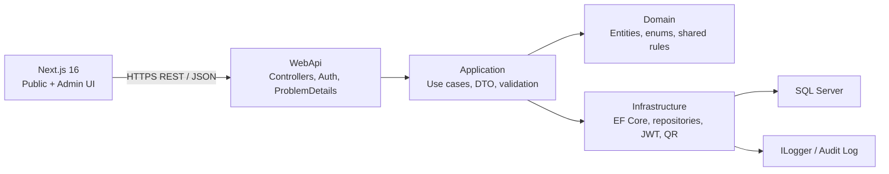
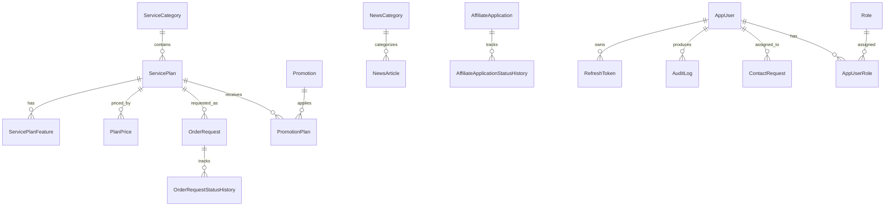

# Executive Summary

Xây dựng **CloudServiceStore**: website giới thiệu và tiếp nhận yêu cầu mua dịch vụ Cloud (VPS, Hosting, Domain, Email doanh nghiệp, SSL, Anti-DDoS), kèm trang quản trị nội dung, giá, khuyến mãi, đơn yêu cầu, affiliate và báo cáo.

Chọn kiến trúc: **ASP.NET Core Web API trên .NET 10 LTS + Next.js 16 App Router + SQL Server**. Đề PDF ban đầu ghi .NET 8/9, tuy nhiên giảng viên đã yêu cầu sử dụng công nghệ mới nhất; vì vậy nhóm thống nhất dùng .NET 10 LTS. Quyết định này cần được ghi rõ trong README và báo cáo để tránh bị hiểu là làm sai phiên bản đề. .NET 10 được hỗ trợ đến tháng 11/2028. [Chính sách hỗ trợ .NET](https://dotnet.microsoft.com/en-us/platform/support/policy) Next.js 16 là nhánh phù hợp để triển khai App Router. [Next.js releases](https://nextjs.org/blog)

Phạm vi cần kiểm soát: đây là website **bán và tiếp nhận yêu cầu**, không phải hệ thống provisioning thực tế tự tạo VPS/domain hay tích hợp thanh toán. Những phần đó chỉ nên làm điểm cộng sau MVP.

## Quyết định MVP đã chốt

- **Không tích hợp thanh toán thật**: nút đặt hàng chỉ tạo `OrderRequest` với báo giá đã chốt (`QuotedAmount`); nhân viên liên hệ và xử lý thủ công.
- **Không tự cấp phát VPS/Hosting/Domain thật**: hệ thống không gọi API nhà cung cấp, không tạo máy ảo, tên miền, DNS hoặc hóa đơn thật.
- Không tạo bảng `Payment`, `Invoice`, `ProvisionedResource` trong MVP. Nếu mở rộng sau này, các module đó phải tách riêng và chỉ tích hợp qua Application abstractions.
- Luồng MVP: xem gói → chọn chu kỳ → gửi yêu cầu → Admin/Editor đổi trạng thái → ghi lịch sử và audit log.

# Phân tích yêu cầu

## Mục tiêu

- Công khai thương hiệu, danh mục dịch vụ, bảng giá, khuyến mãi, tin tức.
- Khách gửi yêu cầu đặt dịch vụ/liên hệ/đăng ký affiliate.
- Admin và Editor vận hành dữ liệu, xử lý đơn, xem dashboard/audit.
- Thể hiện rõ Clean Architecture, REST API, JWT, test, Docker, CI/CD và teamwork.

## Nhóm người dùng và quyền

| Nhóm | Quyền |
|---|---|
| Khách chưa đăng nhập | Xem nội dung công khai và tìm kiếm tin tức; đăng ký tài khoản Customer để gửi order/affiliate |
| Editor | CRUD tin tức/blog; xem và chuyển trạng thái yêu cầu đặt dịch vụ và đăng ký Affiliate; đổi mật khẩu cá nhân |
| Admin | CRUD danh mục, gói, giá, khuyến mãi và QR; toàn quyền tin tức/order/affiliate; xem dashboard, export Excel, audit log; quản lý tài khoản quản trị nếu triển khai |
| System | Tạo audit log, sinh QR, ghi thời gian và người thao tác |

## Phân loại phạm vi

| Nhóm | Chức năng |
|---|---|
| **Bắt buộc / Must-have** | Landing, giới thiệu, dịch vụ/gói/giá, khuyến mãi, testimonial/logo khách hàng, tin tức, order request, affiliate, dashboard, Excel export, admin CRUD, JWT + refresh token, Admin/Editor, QR, audit log, pagination/filter/sort, ≥15 test, Docker, GitHub Actions |
| **Nên có / Should-have** | Soft delete nhất quán, policy authorization chi tiết, integration test với SQL Server container, health check, Markdown editor có preview |
| **Điểm cộng / Nice-to-have** | Deploy cloud, upload ảnh có object storage, email notification, rate limiting nâng cao, Dapper cho query dashboard |
| **Không làm trong MVP** | Thanh toán thật, provision VPS/domain thật, tích hợp nhà cung cấp domain, ticket/chat realtime, đa tiền tệ, đa ngôn ngữ |

## Giả định cần chốt

- “Đặt hàng” tạo `OrderRequest`, chưa thanh toán và chưa tự cấp dịch vụ.
- Giá lưu theo VND, `decimal(18,2)`.
- Một order chọn **một** `ServicePlan`; cấu hình tùy chỉnh là ghi chú/text, không làm configurator phức tạp.
- QR dẫn về URL công khai của gói, không chứa bí mật.
- URL QR được chốt là `/services/{slug}`; trang chi tiết sẽ có nút đặt dịch vụ.
- Hero banner là nội dung tĩnh trong frontend ở MVP; chưa tạo CRUD/API `HeroBanner`.
- Trang giới thiệu, Datacenter, Certificate và SLA phải hiển thị công khai; dữ liệu seed/static trước, CRUD Admin là mở rộng khi còn thời gian.
- `ContactRequest` tách riêng `OrderRequest`: dùng cho yêu cầu tư vấn/liên hệ không chọn gói dịch vụ.
- `ServicePlanFeature` là nguồn thông số chính để hiển thị CPU/RAM/SSD/Bandwidth; không dùng `SpecificationsJson` làm nguồn dữ liệu thứ hai.
- Editor chỉ được sửa tin tức và xử lý order/affiliate; **không** được sửa danh mục, gói, giá, khuyến mãi, QR, user, dashboard, Excel export hoặc audit log.
- Không cho xóa cứng dữ liệu nghiệp vụ đã được dùng trong order; dùng soft delete.

## MVP khả thi

Hoàn thành trước:

1. Authentication, role và audit cơ bản.
2. CRUD Service Category → Service Plan → Plan Price.
3. Landing/bảng giá/dịch vụ công khai.
4. Khuyến mãi, QR.
5. Tạo và xử lý Order Request, Contact Request.
6. CRUD tin tức.
7. Affiliate, dashboard cơ bản, Excel export, audit log.
8. Testimonial/logo khách hàng ở mức CRUD và hiển thị cơ bản.
9. Test tối thiểu 15 case, Docker Compose, CI, README.

Cắt giảm đầu tiên khi thiếu thời gian: biểu đồ dashboard nâng cao, quy trình duyệt affiliate nhiều bước, rich text upload ảnh và deployment cloud. Không được cắt bỏ hoàn toàn testimonial/logo, affiliate, dashboard hoặc Excel vì đây là chức năng được liệt kê trong đề.

# Công nghệ được lựa chọn

## So sánh frontend

| Tiêu chí | Next.js App Router | Blazor WASM/Server |
|---|---|---|
| Độ khó học | Cần React/TypeScript | Dễ hơn nếu nhóm chỉ biết C# |
| Tích hợp API .NET | Rất tốt qua REST | Rất tốt |
| SEO Landing Page | **Rất tốt** với SSR/metadata | WASM yếu hơn; Server tốt hơn nhưng vận hành phức tạp |
| Responsive/UI hiện đại | **Rất mạnh**, hệ sinh thái lớn | Làm được nhưng ít mẫu/UI ecosystem hơn |
| JWT | Phổ biến, middleware/HTTP-only cookie | Làm được nhưng cần cẩn thận WASM storage |
| Tốc độ demo marketing site | **Nhanh** | Khá nhanh |
| Deploy | Web/API tách biệt, linh hoạt | Blazor Server phụ thuộc kết nối SignalR |
| Phù hợp đồ án | **Tốt nếu có 1–2 thành viên biết React** | Tốt khi nhóm thuần C# |

**Chọn Next.js 16 + React App Router.** Website Cloud có Landing Page và SEO là trọng tâm; Next.js cho SSR, metadata, responsive UI và demo hiện đại tốt hơn. Backend vẫn là trọng tâm .NET/Clean Architecture nên vẫn đáp ứng yêu cầu kiến trúc.

## Stack chốt

| Hạng mục | Lựa chọn |
|---|---|
| Backend | ASP.NET Core Web API, .NET 10 LTS |
| ORM | EF Core 10 + SQL Server |
| Validation | Validation ở Application service và business exception theo từng module |
| Mapping | Mapping thủ công bằng các hàm `Map` trong Application service |
| Auth | ASP.NET Core Authentication + JWT Bearer |
| Authorization | Role-based + policy `ManageUsers`, `ViewAuditLogs` |
| Password | ASP.NET Core `PasswordHasher<AppUser>` (PBKDF2) |
| QR | QRCoder |
| Excel | ClosedXML |
| Logging | `ILogger` của ASP.NET Core + `AuditLog` nghiệp vụ |
| API Docs | ASP.NET Core OpenAPI (`AddOpenApi`/`MapOpenApi`) |
| Tests | xUnit, Moq, `WebApplicationFactory`, Coverlet |
| Frontend | Next.js 16, TypeScript, CSS/Tailwind utilities |
| Forms | React client components với validation ở API/Application |
| Fetching | `fetch` qua wrapper `apiFetch`; refresh bằng HttpOnly cookie |
| Charts | Các component dashboard hiện có, không phụ thuộc thư viện chart riêng |
| Editor | Markdown qua `react-markdown`, không bật raw HTML |
| Containers | Multi-stage Dockerfile, Docker Compose |
| CI | GitHub Actions |
| Lint/format | ESLint và TypeScript kiểm tra bằng `tsc --noEmit` |

# Kiến trúc hệ thống



## Quy tắc 4 tầng

| Tầng | Trách nhiệm | Được tham chiếu | Tuyệt đối không đặt |
|---|---|---|---|
| `Domain` | Entity, enum và shared business rule | Không phụ thuộc tầng nào | EF Core, controller, DTO HTTP, JWT, SQL |
| `Application` | Use case/CQRS handler, DTO, validator, interface repository/service | Domain | `DbContext`, SQL, controller, thư viện giao diện |
| `Infrastructure` | EF Core, repository, migrations, JWT, QR, file/export, implementations | Application, Domain | Business workflow nằm trong controller |
| `WebApi` | Endpoint/controller, DI, security extensions, auth config, OpenAPI | Application, Infrastructure | EF query/business logic trực tiếp |

## Cấu trúc solution

```text
CloudServiceStore.sln
src/
    CloudServiceStore.Domain/
      Common/ Entities/ Enums/
    CloudServiceStore.Application/
      Common/ Auth/ Catalog/ News/ Orders/ Promotions/ Reporting/
    CloudServiceStore.Infrastructure/
      Authentication/ Persistence/ Reporting/ DependencyInjection.cs
    CloudServiceStore.WebApi/
      Controllers/ Security/ Program.cs
frontend/
tests/
deploy/
docs/
```

## Luồng request

`Next.js` gọi API → Controller chỉ nhận DTO và trả HTTP response → Application service kiểm tra query/business rule → service gọi repository abstraction → Infrastructure triển khai bằng EF Core → SQL Server → Application trả DTO → Controller/security extensions trả lỗi dạng `ProblemDetails`.

# Domain Model

Entity được tách nền tảng: `BaseEntity` chứa `Id`; `AuditableEntity` thêm `CreatedAt`, `CreatedBy`, `UpdatedAt`, `UpdatedBy`; chỉ `SoftDeletableEntity` mới có `IsDeleted`, `DeletedAt`, `DeletedBy`.

| Entity | Mục đích và trường chính | Quan hệ |
|---|---|---|
| `ServiceCategory` | `Name`, `Slug`, `Description`, `DisplayOrder`, `IsActive` | 1-n `ServicePlan` |
| `ServicePlan` | `CategoryId`, `Name`, `Slug`, `Summary`, `IsFeatured`, `IsActive`, `QrCodePath` | n-1 Category; 1-n Price/Feature/Order |
| `ServicePlanFeature` | `PlanId`, `FeatureKey`, `DisplayName`, `Value`, `Unit`, `DisplayOrder` | nguồn thông số chính, n-1 Plan |
| `PlanPrice` | `PlanId`, `BillingCycle`, `Amount`, `Currency`, `EffectiveFrom`, `EffectiveTo`, `IsActive` | n-1 Plan |
| `Promotion` | `Code`, `Name`, `DiscountType`, `DiscountValue`, `StartsAt`, `EndsAt`, `IsActive` | n-n Plan qua `PromotionPlan` |
| `NewsCategory` | `Name`, `Slug`, `Description` | 1-n Article |
| `NewsArticle` | `CategoryId`, `Title`, `Slug`, `Summary`, `ContentMarkdown`, `PublishedAt`, `Status` | n-1 NewsCategory |
| `OrderRequest` | `PlanId`, `CustomerType`, contact, `CompanyName`, `TaxCode`, `BillingCycle`, `QuotedAmount`, snapshots, `Status`, `Note` | n-1 Plan; 1-n StatusHistory |
| `OrderRequestStatusHistory` | `OrderRequestId`, `FromStatus`, `ToStatus`, `Note`, `ChangedBy` | n-1 Order |
| `AffiliateApplication` | applicant contact, `Website`, `Status`, `ReviewedBy`, `ReviewNote` | n-1 AppUser nullable |
| `AffiliateApplicationStatusHistory` | `AffiliateApplicationId`, `FromStatus`, `ToStatus`, `Note`, `ChangedBy`, `ChangedAt` | n-1 AffiliateApplication |
| `ContactRequest` | `FullName`, `Email`, `Phone`, `CompanyName`, `Subject`, `Message`, `Status`, `AssignedTo`, `ProcessedAt` | yêu cầu tư vấn; trạng thái có audit |
| `CustomerTestimonial` | `CustomerName`, `CompanyName`, `Position`, `Content`, `AvatarUrl`, `Rating`, `DisplayOrder`, `IsPublished` | hiển thị trang khách hàng |
| `CustomerLogo` | `Name`, `LogoUrl`, `WebsiteUrl`, `DisplayOrder`, `IsActive` | hiển thị trang khách hàng |
| `CompanyProfile` | `CompanyName`, `Introduction`, `History`, `Mission`, `Vision`, `SupportInformation`, `IsPublished` | profile singleton cho trang giới thiệu |
| `Datacenter` / `Certificate` / `SlaCommitment` | nội dung hạ tầng, chứng chỉ và uptime/SLA | seed/static trong MVP; CRUD Admin là mở rộng |
| `AppUser` | `Email`, `PasswordHash`, `FullName`, `IsActive`, `LastLoginAt` | n-n Role; 1-n RefreshToken/AuditLog |
| `Role` | `Name`, `Description` | n-n AppUser qua `AppUserRole` |
| `RefreshToken` | `UserId`, `TokenHash`, `ExpiresAt`, `RevokedAt`, `ReplacedByTokenHash` | n-1 AppUser |
| `AuditLog` | `UserId`, `Action`, `EntityName`, `EntityId`, `OldValuesJson`, `NewValuesJson`, `IpAddress`, `OccurredAt` | n-1 AppUser nullable |

`AffiliatePolicy` lưu Markdown chính sách hoa hồng trong `SystemSetting` ở MVP; chỉ tách thành entity nếu cần version/publish workflow riêng.

## ERD Mermaid



- Enum: `BillingCycle`, `DiscountType`, `OrderStatus`, `ContactRequestStatus`, `ArticleStatus`, `AffiliateStatus`, `CustomerType` (`Individual`, `Business`).
- Soft delete: Category, Plan, Promotion, NewsCategory, NewsArticle, Testimonial, Logo, Datacenter, Certificate. Không soft-delete `PlanPrice`, `AuditLog`, `RefreshToken`, Order/Affiliate Status History.
- Unique index: `AppUser.Email`, `Role.Name`, `ServiceCategory.Slug`, `ServicePlan.Slug`, `NewsArticle.Slug`, `Promotion.Code`.
- Index: `PlanPrice(PlanId, IsActive, EffectiveFrom)`, `OrderRequest(Status, CreatedAt)`, `AuditLog(OccurredAt, UserId)`.
- Cascade delete chỉ dùng cho aggregate phụ thuộc: Plan → Feature; Order → StatusHistory. Các quan hệ audit/giá/order dùng `Restrict`.

`OrderRequest` phải lưu `QuotedAmount`, `PlanNameSnapshot`, `PlanSpecificationSnapshot`. Khi giá thay đổi, thêm dòng `PlanPrice` mới với `EffectiveFrom`; không update hoặc xóa giá cũ đã từng được dùng.

Với `CustomerType = Business`, `CompanyName` là bắt buộc; `TaxCode` là tùy chọn trong MVP. `OrderRequest` không có `DELETE`: chỉ tạo, xem, đổi trạng thái và export để giữ lịch sử/audit.

# Use Cases

- Auth: `Login`, `RefreshAccessToken`, `Logout`, `ChangePassword`.
- Service Categories: `Create`, `Update`, `Delete`, `GetById`, `GetPaged`.
- Service Plans: `Create`, `Update`, `Delete`, `GetDetail`, `GetPublicPaged`, `GenerateQrCode`.
- Prices: `CreatePriceVersion`, `EndPriceVersion`, `GetPriceHistory`.
- Promotions: `Create`, `Update`, `Delete`, `GetPaged`, `GetActiveForPlan`.
- News: `Create`, `Update`, `Publish`, `Unpublish`, `Delete`, `GetPublicPaged`, `GetBySlug`.
- Orders: `CreateOrderRequest`, `GetPaged`, `GetDetail`, `ChangeStatus`; consultation is represented by `OrderRequest`.
- Affiliates: `SubmitApplication`, `GetPaged`, `Review`.
- Affiliate Status History: `ChangeAffiliateApplicationStatus`, `GetStatusHistory`.
- News Categories: `Create`, `Update`, `Delete`, `GetPaged`.
- Customers: `Create/Update/Delete/PublishTestimonial`, `Create/Update/DeleteCustomerLogo`.
- Company Content: public landing/about content, datacenter presentation, certificates and SLA presentation; editable API fields cover landing/about/infrastructure/SLA.
- Dashboard: `GetMonthlyOrderStats`, `GetPopularPlans`, `GetInterestedServices`.
- Audit: `GetPagedAuditLogs`.

DTO tách riêng: `CreateXRequest`, `UpdateXRequest`, `XDetailDto`, `XListItemDto`, `XQueryParameters`. Không expose entity EF Core.

## Đặc tả các use case trọng yếu

| Use case | Input → Output | Validation và lỗi nghiệp vụ | Quyền | Dependency | Audit |
|---|---|---|---|---|---|
| `Login` | `LoginRequest` → `AuthResponse` + refresh cookie | Email/password bắt buộc; tài khoản tồn tại, active; sai thông tin trả 401 | Public | `IAuthRepository`, password/token services | Login success/failure, không log password |
| `RefreshAccessToken` | Refresh cookie → `AuthResponse` | Token tồn tại, chưa hết hạn/revoke; phát hiện reuse thì revoke token family | Public có refresh cookie | `IAuthRepository`, token service | Token rotated/reuse detected |
| `CreateServicePlan` | `CreateServicePlanRequest` → `ServicePlanDetailDto` | Category active; name/slug unique; thông số hợp lệ | Admin | Catalog repository | CREATE ServicePlan |
| `CreatePriceVersion` | `CreatePlanPriceRequest` → `PlanPriceDto` | Amount không âm; chu kỳ hợp lệ; khoảng hiệu lực không chồng lấn | Admin | Catalog repository | Price created/closed with actor/time |
| `CreatePromotion` | `CreatePromotionRequest` → `PromotionDto` | Thời gian hợp lệ; phần trăm 0–100; mã unique; plan tồn tại | Admin | Promotion repository, Strategy factory | CREATE Promotion |
| `CreateOrderRequest` | `CreateOrderRequest` → `OrderConfirmation` | Plan active; giá đang hiệu lực; thông tin liên hệ hợp lệ; promotion còn hạn | Customer | Catalog/order repository, Strategy factory | CREATE OrderRequest |
| `ChangeOrderStatus` | `UpdateOrderStatusRequest` → `OrderDetailDto` | Chuyển trạng thái theo state machine; không mở lại trạng thái cuối | Admin, Editor | Order repository | ORDER_STATUS_CHANGED |
| `GenerateServicePlanQrCode` | Plan id → `QrCodeDto` | Plan tồn tại; URL public hợp lệ | Admin | Catalog repository, `IQrCodeService` | QR_REGENERATED |
| `PublishNewsArticle` | Article id → `NewsArticleDetailDto` | Title/slug/content hợp lệ; slug unique; Markdown an toàn khi render | Admin, Editor | News repository | ARTICLE_PUBLISHED |
| `ExportOrderRequests` | `OrderExportQuery` → `.xlsx` stream | Bộ lọc hợp lệ; giới hạn phạm vi ngày | Admin | Reporting repository, `IExcelExportService` | ORDERS_EXPORTED |

Use case ghi audit thông qua repository và cùng `SaveChangesAsync` của EF Core; source hiện không có lớp `IUnitOfWork` hoặc Domain Event riêng.

# REST API

Base URL: `/api/v1`; response JSON camelCase; endpoints dùng danh từ số nhiều.

| Nhóm | Endpoint chính | Role |
|---|---|---|
| Auth | `POST /auth/login`, `POST /auth/register`, `POST /auth/refresh`, `POST /auth/logout`, `GET /auth/me`, `PUT /auth/password`, `PUT /auth/profile` | public/auth |
| Catalog | `GET/POST/PUT/DELETE /service-categories`, `GET/POST/PUT/DELETE /service-plans` | GET public; mutate Admin |
| Prices/QR | `POST /service-plans/{id}/prices`, `PATCH /plan-prices/{id}/effective-to`, `POST /service-plans/{id}/qr-code`, `GET /service-plans/{id}/qr-code/image` | GET public; mutate Admin |
| Promotions | `GET/POST/PUT/DELETE /promotions` | GET public; mutate Admin |
| News | `GET /news-categories`, `GET /news-articles`, `GET /news-articles/{slug}`, CRUD/publish admin endpoints | public/Admin/Editor |
| Landing | `GET /landing-content`, admin update, testimonial/logo CRUD | public; mutate Admin |
| Orders | `POST/GET /orders`, `GET /orders/{id}`, `PATCH /orders/{id}/status` | Customer; manage Admin/Editor |
| Affiliates | `GET /affiliate-program`, `POST /affiliate-applications`, query/review endpoints | Customer; manage Admin/Editor |
| Customer account | `GET /account/orders`, `/account/orders/{id}`, `/account/affiliates`, `/account/affiliates/{id}` | Customer |
| Dashboard/Audit | `GET /dashboard/order-summary`, `/popular-plans`, `/service-interest`, `/audit-logs` | Admin |
| Export | `GET /exports/order-requests.xlsx` | Admin |

Query chuẩn ở các list Catalog, News, Orders và Promotions: `?page=1&pageSize=20&search=vps&sortBy=createdAt&sortDirection=desc&status=New`.

```json
{
  "items": [],
  "page": 1,
  "pageSize": 20,
  "totalCount": 125,
  "totalPages": 7,
  "hasNextPage": true
}
```

Lỗi dùng RFC Problem Details với `type`, `title`, `status`, `traceId`, `errors`.

## Contract API cần chốt trước khi lập trình

| Endpoint | Request | Thành công | Lỗi chính |
|---|---|---|---|
| `POST /api/v1/auth/login` | `{ email, password }` | `200 AuthResponse`, set refresh cookie | `400`, `401`, `429` |
| `POST /api/v1/auth/refresh` | Refresh cookie | `200 AuthResponse`, rotate cookie | `401`, `409` khi reuse |
| `POST /api/v1/service-plans` | `CreateServicePlanRequest` | `201` + `Location` header | `400`, `403`, `404`, `409` |
| `POST /api/v1/service-plans/{id}/prices` | `CreatePlanPriceRequest` | `200 PlanPriceDto` | `400`, `403`, `404`, `409` overlap |
| `GET /api/v1/service-plans` | paging/search/category/sort | `200 PagedResult<ServicePlanListItemDto>` | `400` query không hợp lệ |
| `POST /api/v1/orders` | contact, planId, cycle, note | `201 OrderConfirmation` | `400`, `401`, `404`, `409` plan/price inactive |
| `PATCH /api/v1/orders/{id}/status` | `{ status, note }` | `200 OrderDetailDto` | `400`, `403`, `404`, `409` transition |
| `GET /api/v1/exports/order-requests.xlsx` | date/status filters | `200` Excel stream | `400`, `401`, `403` |

Tất cả endpoint ghi dữ liệu phải nhận DTO riêng, kiểm tra role/policy ở WebApi và kiểm tra business rule lại trong Application. `DELETE` dùng `204`; create dùng `201`; không trả entity EF Core.

# Bảo mật

- Access token JWT: 15 phút; claims `sub`, `email`, `role`.
- Refresh token: 7 ngày, random cryptographic token, lưu hash trong DB.
- Refresh token đặt trong `HttpOnly`, `Secure`, `SameSite=Strict/Lax` cookie; access token giữ in-memory.
- Rotation: revoke token cũ + tạo token mới; phát hiện reuse → revoke toàn bộ token user.
- Với refresh token dùng cookie, endpoint refresh/logout phải kiểm tra `Origin`/`Referer`, cấu hình CORS không dùng wildcard và bổ sung CSRF token nếu frontend/backend chạy khác site.
- Password dùng `PasswordHasher<TUser>` PBKDF2.
- CORS chỉ allow domain frontend; HTTPS production.
- Rate limit login/order; secrets dùng environment variables/User Secrets/GitHub Secrets.
- Swagger production tắt hoặc bảo vệ.
- EF Core parameterization; Dapper phải dùng named parameters.
- Markdown phải sanitize; upload giới hạn MIME/extension/kích thước.
- Audit login, CRUD, giá, trạng thái, export; không log password/token.

# Design Patterns và SOLID

1. **Repository**: các abstraction như `ICatalogRepository`, `IOrderRepository`, `INewsRepository` tách Application khỏi EF Core implementation.
2. **Strategy**: `IPromotionDiscountStrategy`, `PercentageDiscountStrategy`, `FixedAmountDiscountStrategy`; tách thuật toán khuyến mãi.
3. **Factory**: `DiscountStrategyFactory` chọn Strategy theo `DiscountType`.

Áp dụng SOLID bằng use case nhỏ (S), strategy mở rộng (O), interface thay thế được (L), interface chuyên biệt (I), Application chỉ phụ thuộc abstraction (D). Tránh generic repository/Utlity/Singleton khi không có lợi ích rõ ràng.

# Frontend Architecture

```text
/
├─ /about
├─ /services/[slug]
├─ /pricing
├─ /customers
├─ /news/[slug]
├─ /affiliate
├─ /order
├─ /login và /account/{login,register,...}
└─ /admin/{dashboard,catalog,pricing,promotions,news,orders,affiliates,audit-logs,landing,profile,workspace}
```

Public pages dùng Server Components/SSR cho nội dung landing; admin và customer account dùng Client Components. Dữ liệu gọi bằng `fetch`/`apiFetch`, refresh session qua HttpOnly cookie, và route guard phía client chỉ là lớp UX bổ sung; API vẫn kiểm tra JWT/policy ở WebApi.

Acceptance criteria responsive: không có cuộn ngang ở 360 px; menu có phiên bản mobile; bảng giá chuyển card hoặc cuộn ngang có kiểm soát; form thao tác được ở 360 px; bảng/admin/chart không tràn khung.

# Testing Plan

Nhóm cam kết triển khai tối thiểu 15 test đầu tiên; các test còn lại dùng để tăng coverage và kiểm tra tích hợp.

| # | Test name | Input/Arrange | Kết quả mong đợi | Mock |
|---:|---|---|---|---|
| 1 | `CreatePrice_AmountIsNegative_ReturnsValidationError` | Amount = -1 | Validation error | Không |
| 2 | `CreatePrice_AmountIsZero_ReturnsValidationError` | Amount = 0 | Validation error | Không |
| 3 | `CreatePrice_PeriodOverlaps_ReturnsConflict` | Khoảng giá chồng lấn | Conflict/domain error | Price repository |
| 4 | `CreatePromotion_EndBeforeStart_ReturnsValidationError` | End < Start | Validation error | Không |
| 5 | `CreatePercentagePromotion_Over100_ReturnsValidationError` | 110% | Validation error | Không |
| 6 | `PercentageDiscount_ValidPromotion_ReturnsDiscountedPrice` | 100.000, giảm 10% | 90.000 | Không |
| 7 | `FixedDiscount_GreaterThanPrice_ReturnsZero` | Giá 50.000, giảm 70.000 | 0, không âm | Không |
| 8 | `CreateOrder_PlanInactive_ReturnsBusinessError` | Plan inactive | Không tạo order | Plan repository |
| 9 | `CreateOrder_NoActivePrice_ReturnsBusinessError` | Không có giá hiệu lực | Không tạo order | Plan/Price repository |
| 10 | `CreateOrder_ValidData_SavesPriceSnapshot` | Plan và giá hợp lệ | Lưu snapshot/quoted amount | Repositories |
| 11 | `ChangeStatus_NewToProcessing_Succeeds` | Pending → Contacted | Status cập nhật | Order repository |
| 12 | `ChangeStatus_CompletedToNew_ReturnsConflict` | Completed → New | Không cập nhật | Order repository |
| 13 | `Login_ValidCredentials_ReturnsTokens` | User active, đúng password | Access + refresh | User repo, password/token services |
| 14 | `Login_InvalidPassword_ReturnsUnauthorized` | Sai password | 401 | User repo, password service |
| 15 | `Refresh_ValidToken_RotatesToken` | Token còn hạn | Revoke cũ, tạo mới | Token repo/service |
| 16 | `Refresh_RevokedToken_ReturnsUnauthorized` | Token revoked | 401 | Token repository |
| 17 | `Refresh_ReusedToken_RevokesTokenFamily` | Dùng lại token cũ | Revoke toàn bộ family | Token repository |
| 18 | `Editor_CreateServicePlan_ReturnsForbidden` | JWT Editor | 403 | API integration |
| 19 | `Editor_PublishNewsArticle_Succeeds` | JWT Editor | 200 | News repository |
| 20 | `Editor_ViewAuditLogs_ReturnsForbidden` | JWT Editor | 403 | API integration |
| 21 | `GenerateQr_ExistingPlan_ReturnsPng` | Plan hợp lệ | PNG/URL đúng | Plan repo, QR service |
| 22 | `UpdatePrice_WritesAudit` | Giá cũ đóng hiệu lực | Audit có actor, action, entity và thời gian | Audit writer |
| 23 | `GetPlans_ValidPaging_ReturnsMetadata` | page 2, size 10 | Đúng items/total pages | Read repository |
| 24 | `OrderExport_ValidFilter_ReturnsXlsx` | Bộ lọc ngày/status | File Excel hợp lệ | Order repo, export service |
| 25 | `SubmitCustomerOrder_ValidData_CreatesRequest` | Customer, plan và cycle hợp lệ | Tạo `OrderRequest` `Pending` | Order repository |
| 26 | `Editor_ManagePrices_ReturnsForbidden` | JWT Editor | 403 | API integration |
| 27 | `UpdatePrice_PublicApiReturnsNewPrice` | Giá mới có hiệu lực | Public API trả giá mới, order cũ không đổi | Plan/Price repository |

Dùng xUnit, Moq, FluentAssertions, `WebApplicationFactory`, Coverlet. Mục tiêu coverage Domain/Application ≥70%.

# Docker và CI/CD

Dockerfile multi-stage dùng SDK/runtime .NET 10; Compose gồm `api`, `sqlserver`, named volume, environment variables và healthcheck `/health`. SQL Server phải đạt trạng thái healthy trước khi API/migrator chạy.

Chọn phương án migration thống nhất:

1. Container `sqlserver` khởi động và healthcheck bằng `sqlcmd`.
2. Container `migrator` dùng image API, chạy `dotnet ef database update`, hoàn tất với exit code 0.
3. Container `api` chỉ khởi động sau khi SQL healthy và migrator thành công.
4. Seed role Admin/Editor và tài khoản demo bằng startup seeder idempotent; mật khẩu lấy từ environment variable.
5. Kiểm tra nghiệm thu bằng `docker compose up --build` trên một máy chưa có database/volume.

GitHub Actions: checkout → setup .NET/Node → restore → build → test + coverage → frontend lint/build → Docker build. Các lỗi phổ biến: port bị chiếm, SQL password không đạt policy, dùng `localhost` trong connection string container, API khởi động trước SQL, image không tương thích architecture.

Definition of Done cho CI/Docker: backend và frontend build sạch; ≥15 test pass; coverage artifact được upload; Docker image build thành công; `/health` trả `Healthy`; migration và seed chạy được từ volume rỗng; README có lệnh chạy và tài khoản demo.

# Git Workflow

- `main` cho release/demo; `dev` cho tích hợp.
- `feature/<scope>-<name>` và `bugfix/<issue>-<name>`.
- Conventional Commits: `feat(plans): add price versioning`, `test(auth): cover refresh rotation`.
- PR phải có mô tả, ảnh/video, checklist test, reviewer và CI xanh.

Tối thiểu 10 PR: foundation, DB, auth, catalog, prices, promotions/QR, public UI, news, orders, dashboard/audit/export, tests/Docker/CI.

# Phân công thành viên

## Nhóm 3

- A: foundation, DB, auth, security, Docker/CI, auth tests.
- B: category/plan/price/promotion APIs, public services/pricing/QR, pricing tests.
- C: news/order/affiliate/dashboard/audit, landing/admin orders/export/tests.

## Nhóm 4

- A: foundation, DB, auth, security, CI.
- B: catalog, prices, promotions, QR.
- C: landing, about, customer, news, SEO.
- D: orders, affiliate, dashboard, audit, export, integration tests.

Mỗi người phải có backend, frontend hoặc test/DevOps và có PR đáng kể.

# Sprint Plan

| Sprint | Mục tiêu/đầu ra | Definition of Done | PR chính |
|---|---|---|---|
| 0 | Phân tích, ERD, backlog, solution, CI skeleton, wireframe | Dependency đúng chiều; ERD/role/MVP được cả nhóm duyệt | Foundation |
| 1 | Domain/EF/migration/seed, JWT/role/refresh, login UI | Migration chạy; Admin/Editor seed; auth/rotation tests pass | Database; Authentication |
| 2 | Category, Plan, Price, public services/pricing | CRUD đúng role; price versioning; paging/filter/sort; responsive cơ bản | Catalog; Pricing |
| 3 | Promotion, QR, landing/about/customer | Tính giá đúng; QR quét được; testimonial/logo hiển thị | Promotion/QR; Public landing |
| 4 | News CRUD/public, Markdown, SEO | Editor publish được; HTML sanitized; metadata/indexing đúng | News |
| 5 | Customer order, status history, affiliate | Customer submit; state transition; history/audit; Admin/Editor đúng quyền | Orders; Affiliate |
| 6 | Dashboard, Excel, audit, authorization tests | Dashboard có dữ liệu; Excel mở được; audit actor/time; chỉ Admin truy cập | Reporting/Audit |
| 7 | Docker, coverage, integration test, responsive polish | `docker compose up --build` từ volume rỗng; ≥15 test; coverage artifact; CI xanh | Quality/DevOps |
| 8 | Deploy tùy thời gian, dữ liệu demo, báo cáo, slide, rehearsal | Báo cáo 15–25 trang; demo 15 phút ≤ thời gian; mỗi thành viên trả lời được | Documentation/Release |

Critical path: solution → DB → auth → catalog/price → public UI → order → test/container/demo. Làm sớm migration, seed, JWT, plan/price. News và frontend public có thể làm song song từ Sprint 2. Cắt giảm đầu tiên: payment/provisioning, dashboard nâng cao, upload ảnh.

Mỗi Sprint kéo dài khoảng một tuần. Backend owner chịu trách nhiệm API/domain rule; frontend owner chịu trách nhiệm UI/API integration; reviewer không được là tác giả duy nhất của PR. Test phải nằm trong cùng PR với use case, không dồn toàn bộ sang Sprint 7.

# Checklist nghiệm thu

- [x] **Đã kiểm chứng:** Clean Architecture, SOLID, Repository/Strategy/Factory, REST/OpenAPI/ProblemDetails.
- [x] **Đã kiểm chứng:** public/admin responsive UI; JWT, refresh token, Admin/Editor/Customer, password hash.
- [x] **Đã kiểm chứng:** CRUD catalog/plan/price/promotion/news/order; QR; audit.
- [x] **Đã kiểm chứng:** OrderRequest cho liên hệ/đặt dịch vụ; News Category; testimonial/logo công khai; Affiliate policy và status history.
- [x] **Đã kiểm chứng cục bộ:** 186 backend test, 143 frontend test, coverage source-only và responsive checks.
- [x] **Đã kiểm chứng một phần:** Dockerfile, Compose, README và ERD; report/slide/demo cuối kỳ cần hoàn thiện riêng.
- [x] **Đã kiểm chứng:** affiliate, dashboard cơ bản, Excel export, testimonial/logo khách hàng.
- [x] **Đã kiểm chứng:** soft delete, policy authorization, integration test và healthcheck endpoint.
- [ ] **Ngoài phạm vi lần kiểm tra này:** ≥10 PR, review, GitHub Actions và Git contribution.
- [ ] **Điểm cộng:** cloud deployment, custom domain, monitoring.
- [ ] **Rủi ro trừ điểm:** lộ secrets, trả EF entity trực tiếp, overwrite lịch sử giá, thiếu audit/test/PR.

# Kịch bản demo 15 phút

1. Giới thiệu kiến trúc và ERD.
2. Landing → dịch vụ → bảng giá → QR.
3. Khách tạo Order Request VPS.
3a. Khách gửi Contact Request không chọn gói; Editor nhận và chuyển sang Processing.
4. Editor đăng nhập, publish bài viết và chuyển Order Request từ Mới sang Đang xử lý; chứng minh Editor bị từ chối khi truy cập quản lý giá.
5. Admin đăng nhập, cập nhật gói/giá/khuyến mãi và sinh lại QR; xác nhận giá ngoài Landing Page tự cập nhật.
6. Admin xem dashboard, export Excel và kiểm tra audit actor/action/time.
7. Swagger, JWT/role, test/coverage.
8. Docker Compose và GitHub Actions/PR.

Seed data: 6 category, 12 plan, 4 promotion, 8 article, 10 order; tài khoản demo `admin@cloud.local` và `editor@cloud.local` (mật khẩu chỉ cung cấp qua `.env.example`/demo notes, không commit secret).

Dự phòng: video/screenshot Actions/Docker, QR/Excel có sẵn, SQL seed backup, chạy localhost và bản deploy song song.

# Kế hoạch báo cáo và chuẩn bị vấn đáp

## Khung báo cáo PDF 15–25 trang

| Nội dung | Số trang dự kiến | Bằng chứng |
|---|---:|---|
| Bối cảnh, yêu cầu, MVP | 1–2 | Scope/MoSCoW |
| Kiến trúc và dependency | 2–3 | Sơ đồ Clean Architecture, solution tree |
| Domain Model và ERD | 2–3 | ERD, entity/constraint quan trọng |
| SOLID và Design Patterns | 3–4 | Trích code Repository, Strategy và Factory |
| REST API và bảo mật | 2–3 | Swagger, JWT/role, ProblemDetails |
| Frontend và chức năng | 3–4 | Ảnh desktop/mobile, public/admin |
| Testing, coverage, CI/CD, Docker | 2–3 | Test Explorer, coverage, Actions, Compose |
| Git contribution, phân công, kết luận | 1–2 | PR/commit chart, lessons learned |

## Ownership và vấn đáp

Mỗi thành viên phải sở hữu tối thiểu một module backend, một phần frontend hoặc test/DevOps và 2–3 PR có ý nghĩa. Trước demo, mỗi người chuẩn bị trả lời bảy câu: module mình làm; business rule quan trọng; pattern đã dùng; luồng một API; một test case; một PR đã review; một lỗi thực tế và cách khắc phục.

# Rủi ro và cách xử lý

| Rủi ro | Xử lý |
|---|---|
| Scope quá lớn | khóa MVP; không làm payment/provisioning |
| Sai quan hệ/giá lịch sử | chốt ERD, version `PlanPrice`, snapshot order trước UI |
| JWT/CORS lỗi | chạy frontend/API bằng Docker sớm |
| Thiếu test | viết test cùng use case |
| Merge conflict | ownership module, PR nhỏ, rebase thường xuyên |
| Docker/demo lỗi | rehearsal, `.env.example`, backup data/video |
| XSS editor | Markdown + sanitizer, chưa làm raw HTML upload |

# Checklist chốt trước khi nộp

1. Chạy bộ seed Visual QA và xác nhận đủ sáu nhóm dịch vụ bắt buộc trên `/services` và `/pricing`.
2. Chạy backend tests, frontend tests, lint, TypeScript và production build trong phiên sạch.
3. Thu Cobertura coverage, loại file sinh trong `obj` và EF migrations khi tính số liệu source-only.
4. Đưa ERD, kiến trúc, Repository/Strategy/Factory, security và số liệu test vào báo cáo cuối kỳ.
5. Giữ riêng các hạng mục Git/GitHub, CI trên GitHub và deployment để kiểm tra theo phạm vi nộp bài.
