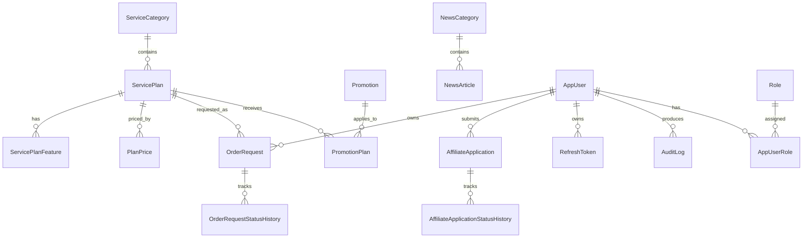

# ERD và quy tắc dữ liệu nền

## Quy tắc trước khi tạo migration

- Primary key dùng `uniqueidentifier`/`Guid`; mọi thời điểm dùng UTC (`datetimeoffset`).
- Entity nghiệp vụ dùng audit fields: `CreatedAt`, `CreatedBy`, `UpdatedAt`, `UpdatedBy`, `IsDeleted`.
- Không thêm bảng Payment, Invoice, ProvisionedResource trong MVP: đơn hàng là yêu cầu tư vấn/đặt dịch vụ, không phải thanh toán hoặc cấp phát thật.
- `OrderRequest` chụp lại `PlanNameSnapshot`, `SpecificationSnapshot`, `OriginalAmount`, `QuotedAmount`, `Currency`, `PromotionCodeSnapshot`; dữ liệu lịch sử không phụ thuộc vào nội dung gói hiện tại.
- `LandingPageContent` lưu cấu hình Hero/About duy nhất; `Testimonial` và `CustomerLogo` là danh sách nội dung công khai có thứ tự, trạng thái bật/tắt và soft delete.
- `AffiliateProgramContent` là nội dung/chính sách chương trình duy nhất; `AffiliateApplication` lưu hồ sơ đối tác và lịch sử chuyển trạng thái để truy vết.
- Giá là immutable version: tạo giá mới bằng dòng `PlanPrice` mới; kết thúc hiệu lực giá cũ bằng `EffectiveTo`, không sửa `Amount` của giá đã từng được báo cho đơn.
- Chỉ một giá active cho cùng `PlanId + BillingCycle` tại một thời điểm; use case phải chặn các khoảng hiệu lực giao nhau.

`AppUserId` trên `OrderRequest` và `AffiliateApplication` là nullable để giữ khả năng tương thích với dữ liệu yêu cầu cũ; luồng mới yêu cầu tài khoản Customer và gắn owner. `LandingPageContent` là bản ghi nội dung công khai duy nhất, còn testimonial/logo là các danh sách nội dung được quản lý độc lập, không có khóa ngoại trực tiếp tới LandingPageContent.

## Ràng buộc và index

| Bảng | Ràng buộc/index |
|---|---|
| `ServiceCategory` | filtered unique `Slug` trên bản ghi chưa soft-delete; index `(IsActive, DisplayOrder)` |
| `ServicePlan` | filtered unique `Slug` trên bản ghi chưa soft-delete; index `(CategoryId, IsActive)` |
| `ServicePlanFeature` | unique `(ServicePlanId, FeatureKey)`; cascade từ Plan |
| `PlanPrice` | index `(ServicePlanId, BillingCycle, EffectiveFrom)`; kiểm tra `Amount >= 0`; restrict khi xóa Plan |
| `Promotion` | unique `Code`; kiểm tra `DiscountValue > 0`, `EndsAt > StartsAt`, billing cycle hợp lệ; index banner/public |
| `PromotionPlan` | unique `(PromotionId, ServicePlanId)`; cascade từ Promotion/Plan |
| `AppUser` | unique `Email`; lưu `FullName`, `AvatarUrl`, `PasswordHash`, `LastLoginAt` |
| `Role` | unique `Name` |
| `RefreshToken` | unique `TokenHash`; index `(AppUserId, RevokedAt, ExpiresAt)` |
| `OrderRequest` | nullable owner `AppUserId`; index `(Status, CreatedAt)`, `(ServicePlanId, CreatedAt)`, `(Email, CreatedAt)`, `(AppUserId, CreatedAt)`; giá gốc/giá báo không âm |
| `OrderRequestStatusHistory` | index `(OrderRequestId, CreatedAt)`; cascade từ OrderRequest |
| `AuditLog` | index `(OccurredAt, AppUserId)`; lưu action/entity, IP và before/after JSON tùy nghiệp vụ |
| `LandingPageContent` | index `IsPublished`; lưu Hero/About/Infrastructure/SLA |
| `Testimonial` | index `(IsActive, DisplayOrder)` |
| `CustomerLogo` | unique `Name`; index `(IsActive, DisplayOrder)` |
| `AffiliateProgramContent` | index `IsPublished` |
| `AffiliateApplication` | nullable owner `AppUserId`; index `(Status, CreatedAt)`, `(Email, CreatedAt)`, `(AppUserId, CreatedAt)` |
| `AffiliateApplicationStatusHistory` | index `(AffiliateApplicationId, CreatedAt)` |
| `NewsCategory` | unique `Slug`; index `(IsActive, DisplayOrder)` |
| `NewsArticle` | unique `Slug`; unique filtered featured article; index status/published/category; restrict khi xóa Category |

Cascade delete chỉ dùng cho dữ liệu thuộc aggregate: `ServicePlanFeature`, `PromotionPlan`, `OrderRequestStatusHistory`, `AffiliateApplicationStatusHistory`, `AppUserRole`. Dùng `Restrict` cho giá, đơn, audit và refresh token để giữ lịch sử.
